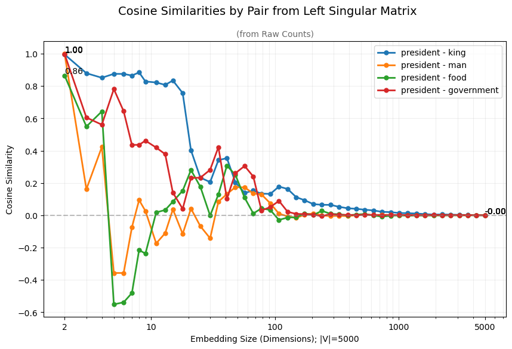
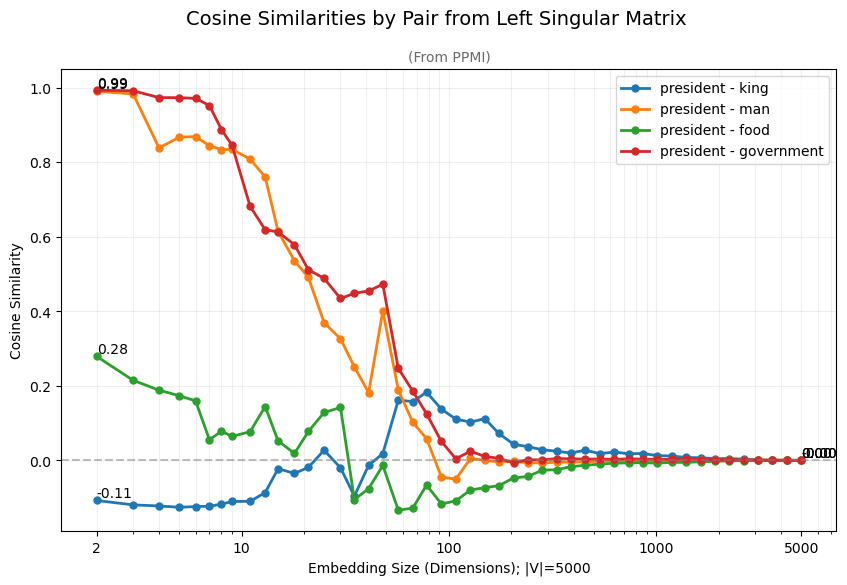
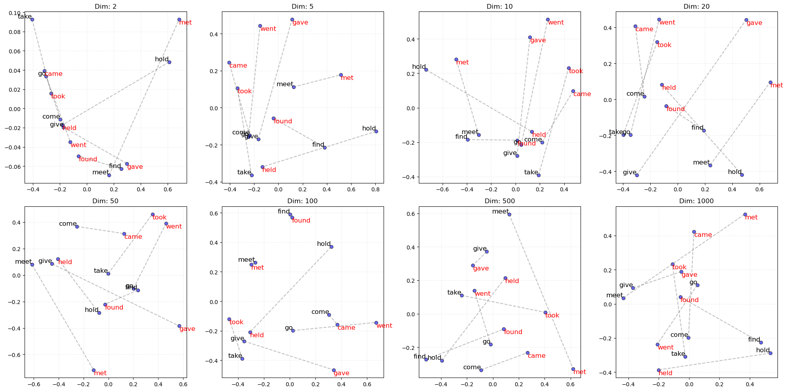

# Embedding Dimensionality's Effect on Semantic Meaning

[Full Project Here](Deep_Learning_Capstone_Project_Augustin_Langlet.ipynb)

## Introduction
As a capstone project for a Deep Learning class, I decided to dig into the fundamental mechanisms behind encoding meaning into word vector representations for NLP. To embed meaning into vector representations, the core principle is to take a co-occurrence matrix that encodes how often given words appear in certain contexts and reduce it to a smaller vector space to squeeze words with similar context patterns together. These vectors then represent the similarity and relation of words, taking advantage of the Distributional Hypothesis in linguistics. This interesting process of reducing the amount of data to extract semantic meaning inspired me to make this project. 

## Hypothesis
Going in, my high level hypothesis was that semantic quality would roughly follow a bell curve as dimensionality increases:
- **Too few dimensions** → model underfits, everything gets squished together, even unrelated words appear similarly
- **Too many dimensions** → embeddings become so sparse/unique that even related words stop looking similar
- Somewhere in the middle should be a sweet spot where semantic structure is most visible

## Approach
After examining multiple methods, I decided on building my word embeddings from scratch using SVD on the raw co-occurrence counts and later PPMI matrices derived from a small corpus.

1. **Corpus:** Since the goal is to examine the theoretical mechanisms and not to create the best possible embeddings, I chose the relatively small and accessible Brown corpus, "news" category with a length of 100,000 words, I took the top 5,000 most frequent words as vocabulary to build my matrices with a standard window size of 4
2. **Decomposition:** SVD on the co-occurrence matrix, truncating to `d` dimensions to get embeddings — chosen over Skip-Gram or SGD-based factorization because truncating an existing SVD is just a slice, no retraining needed, and it avoids the stochastic noise those methods introduce
3. **Modification** raw co-occurrence counts turned out to be dominated by high-frequency words ("the", "of", "in"...), which drowned out real semantic signal. Switching to a **PPMI (Positive Pointwise Mutual Information)** matrix — with add-1 smoothing and alpha-weighted context probabilities — cleaned this up substantially. ([reference](https://web.stanford.edu/~jurafsky/li15/lec3.vector.pdf))
4. **Testing:** swept embedding size from 2 to 5,000 dimensions and tracked cosine similarity between hand-picked word pairs (gender pairs, verb tenses, related/unrelated pairs, etc.), plus a PCA-based visualization inspired by [Mikolov et al. 2013](https://arxiv.org/pdf/1310.4546) to look for analogy-style relational structure.

## Key findings
- Cosine similarity behaved roughly as hypothesized: related pairs stay high longer and decay slowly; unrelated pairs sometimes look similar at very low dimensions but drop off fast as dimensionality increases.
- Raw co-occurrence-based embeddings were noisy and unstable across dimensions. Using PPMI made the trends noticeably more stable and interpretable.

| Raw counts | PPMI |
|---|---|
|  |  |

- The relational-analogy visualizations were noisy and inconsistent as well — some dimensions captured a clean shared "axis" between pairs, others didn't. A bigger corpus and more carefully curated pairs could help.

- I was surprised by the vector embeddings containing negative components considering both base matrices are completely non-negative, causing negative cosine similarities and also having similarities occasionally increase while sweeping through dimensions. But they are indeed not necessarily PSD and have negative eigenvalues which SVD flips to retain positive singular values. It could be valuable to try similar decompositions that don't affect the signs of vectors to make results more legible.

## Code
The whole project and results are accessible on this repo. But you can access a copy of the code through Google Colab below.

Tech Stack: `numpy` · `scipy.linalg.svd` · `scikit-learn` (PCA, cosine similarity) · `matplotlib` · `nltk` (Brown corpus)
